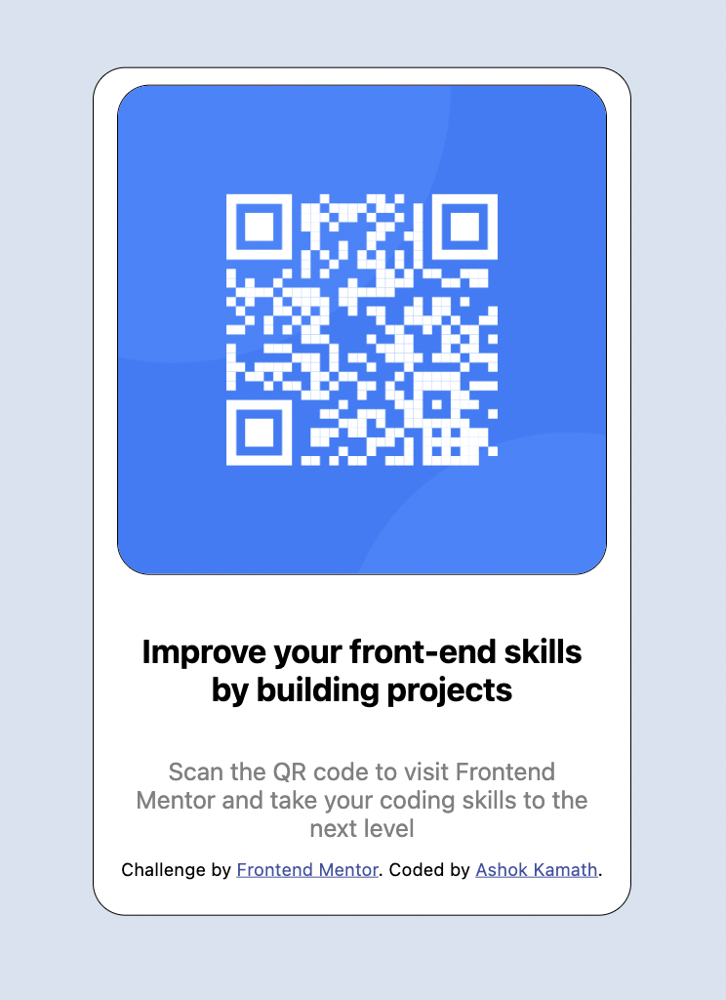

# Frontend Mentor - QR code component

# Final Design 

## Welcome! 👋

Thanks for checking out this front-end coding challenge.

## The challenge

The challenge was to build out this QR code component and get it looking as close to the design as possible.

I used HTML and CSS to complete this project. 

